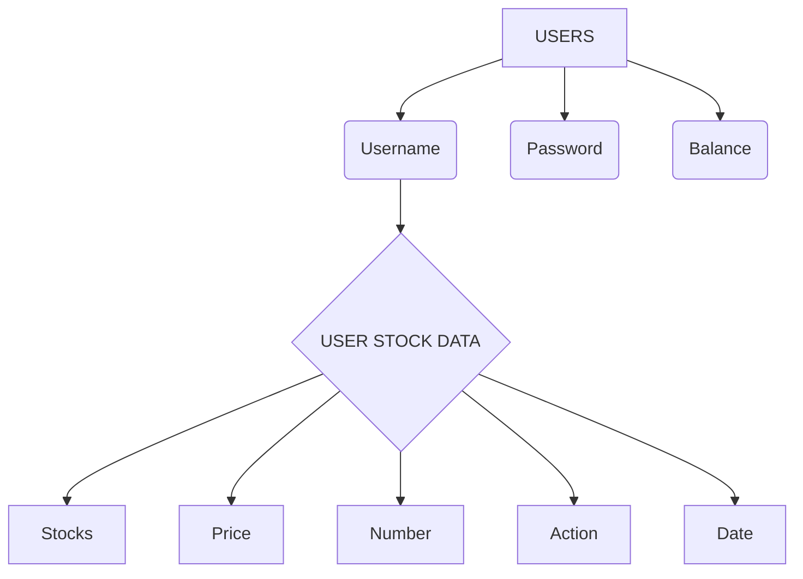

# LIFE OF MONEY
## Project Description:
Innovative Stock Market Trading and Skill-Building Application for Teens and Kids. Our concept is an interactive, dynamic application that combines fun and education in a special way. It is designed exclusively for the younger generation, providing teenagers and children with a secure and engaging platform to develop their stock market trading abilities while having fun with stimulating activities.

## Key Features:
- Stock Trading Simulation: Users may practice trading with our application's realistic stock market simulation without risking any real money. By providing a risk-free environment for young users to learn the ins and outs of stock trading, this feature promotes financial literacy from a young age.
- Safe and Age Appropriate: We prioritize the safety and suitability of our content for the target demographic, ensuring that simulations are age-appropriate and free from any real-world financial risks.
- User-Friendly Interface: Our application boasts a user-friendly interface that is intuitive and easy to navigate, allowing young users to access and enjoy the platform independently.

<details>
    
<summary>Coding Languages Used</summary>

```
> System.out.println("Java");

> .css{
>  height: 10px;
>  width: 20px;
> }

> <p>HTML</p>

> Console.log(Javacript);

> <% System.out.println("JSP"); %>
```
</details>

## HOW TO SET UP:-
When making a website, it requires few things to be done. For example, we need stocks that changes livly so we used an API called Yahoo Stocks API. 
- Click [Here](https://financequotes-api.com/) to access the Yahoo Stock API
- My friend and I have created instructional videos on the topic, which are available on [YouTube](https://www.youtube.com/channel/UCLbTqdupL65iVADSEmJ-UgQ). Feel free to watch them if you encounter any difficulties during the setup process.

INSIDE THE POM FILE
```
<dependency>
    <groupId>com.yahoofinance-api</groupId>
    <artifactId>YahooFinanceAPI</artifactId>
    <version>3.17.0</version>
</dependency>
```
## ADDITIONAL INFORMATION ***(THIS IS IMPORTANT)***:
Here is the list of this you must know how to use and also have it on your Local Device:
- Installedd [Xampp Server](https://www.apachefriends.org/download.html)
- Installed [Eclipse](https://www.eclipse.org/downloads/packages/release/2021-03/r/eclipse-ide-enterprise-java-and-web-developers) on your divise
- Installed [Java](https://www.java.com/en/download/manual.jsp) on your Device
- Installed [Apache Tomcat](https://tomcat.apache.org/download-10.cgi)
- Installed [MySQL Connector](https://dev.mysql.com/downloads/connector/j/8.0.html) on your local Divise
> Note: I have uploaded a series on [Youtube](https://www.youtube.com/channel/UCLbTqdupL65iVADSEmJ-UgQ) Showing how you can install all of this to set up everything on eclipse project.

## SQL Data base Heirachy
> NOTE: If you can't see the diagram here, try to open GitHub on a webpage.

For example: 
```
Username: Jake102
Password: Jakopple
Hint: Jake + Apple
Balance: 12300.32
```

## One Final Key Point to Note to
- This project demonstrates greater efficiency when employing PHP and MySQL queries. However, as newcomers, we initially opted for the most familiar programming languages.
- It's advisable to watch all the provided videos if you encounter any challenges while deciphering the code or if you intend to implement it in your own projects.
- Additionally, it's beneficial to have some familiarity with CSS and JavaScript.
- We are currently using the YahooFinance Stock Quote API in our project, but it is no longer supported. Therefore, any attempts to buy or sell within the project will not work. However, to resolve this issue, you will need to manually update the Yahoo Finance code in the Java sections to the API of your choice.
